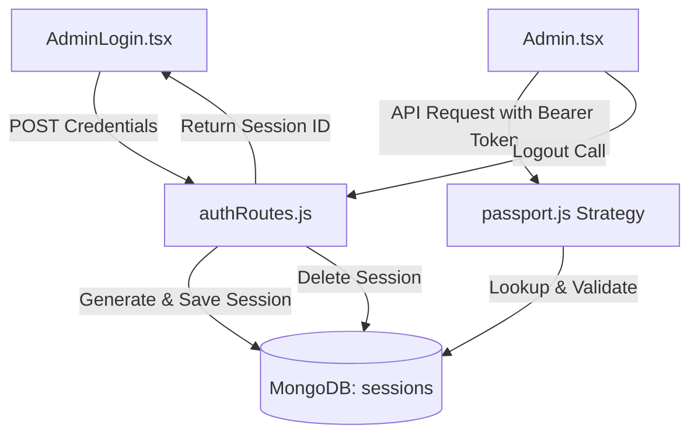

# Stateful MongoDB-Backed Session ID System Walkthrough

This document explains how the stateful session ID system is implemented in your full-stack application, where files are located, and how the token authentication lifecycle is handled from database storage to session revocation.

---

## 📂 File Architecture

The session management logic is divided across the backend server and frontend client files:



### 1. Backend Server Files
* 📄 **[`server/config/passport.js`](file:///Users/user/Downloads/presentationmonday/server/config/passport.js)**: Configures the Custom Passport Strategy that intercepts requests, extracts the Session ID from the Authorization header, and matches it against MongoDB.
* 📄 **[`server/routes/authRoutes.js`](file:///Users/user/Downloads/presentationmonday/server/routes/authRoutes.js)**: Generates random Session IDs, inserts them into the database upon login, and deletes (revokes) them upon logout.
* 📄 **[`server/routes/projectRoutes.js`](file:///Users/user/Downloads/presentationmonday/server/routes/projectRoutes.js)** & **[`contactRoutes.js`](file:///Users/user/Downloads/presentationmonday/server/routes/contactRoutes.js)**: Utilizes the updated Passport middleware (`passport.authenticate('session')`) to block unauthorized CRUD requests.

### 2. Frontend React Files
* 📄 **[`craft-portfolio/src/pages/Admin.tsx`](file:///Users/user/Downloads/presentationmonday/craft-portfolio/src/pages/Admin.tsx)**: Displays the active Session ID and triggers the logout request to clean up the token on both the client's local storage and the server's database.

---

## ⚙️ How It Works (Step-by-Step)

### 1. Generating & Saving the Session ID
When the administrator logs in via the form (or Google OAuth), instead of signing a stateless JWT web token, the server generates a cryptographically secure random session ID using Node's native `crypto` module.

```javascript
// Located in: server/routes/authRoutes.js
async function createAdminSession(email) {
  const db = await connectDB();
  const sessionId = 'sess_' + crypto.randomBytes(24).toString('hex');
  const expiresAt = new Date(Date.now() + 24 * 60 * 60 * 1000); // 24 hours expiry

  await db.collection('sessions').insertOne({
    sessionId,
    email,
    createdAt: new Date(),
    expiresAt
  });

  return sessionId;
}
```

The database stores the session record so the server has a physical record of who is currently logged in.

---

### 2. Verifying the Session with Passport.js
For every protected API call (like creating or deleting projects), the React client includes the session ID in its headers: `Authorization: Bearer sess_...`.

Passport.js intercepts this request using our Custom Session Strategy:

```javascript
// Located in: server/config/passport.js
passport.use(
  'session',
  new SessionStrategy(async (token, done) => {
    try {
      const db = await connectDB();
      const session = await db.collection('sessions').findOne({ sessionId: token });

      if (!session) {
        return done(null, false, { message: 'Invalid or revoked session ID' });
      }

      // Check if session has expired
      if (new Date() > new Date(session.expiresAt)) {
        await db.collection('sessions').deleteOne({ sessionId: token });
        return done(null, false, { message: 'Session expired' });
      }

      // Session is valid
      return done(null, { email: session.email, isAdmin: true });
    } catch (error) {
      return done(error, false);
    }
  })
);
```

---

### 3. Revoking the Session (Logout)
When you click **Terminate Session** on the dashboard, the frontend tells the server to invalidate the token:

```javascript
// Located in: server/routes/authRoutes.js
router.post('/logout', async (req, res, next) => {
  try {
    let token = req.headers.authorization?.split(' ')[1];
    if (token) {
      const db = await connectDB();
      // Remove from database
      await db.collection('sessions').deleteOne({ sessionId: token });
    }
    res.json({ success: true, message: 'Session revoked.' });
  } catch (error) {
    next(error);
  }
});
```

---

## 💡 Benefits for Your Demo
* **CRUD on Sessions**: Authentication is now a physical CRUD action in MongoDB (`insertOne` on login, `findOne` on requests, `deleteOne` on logout/expiry).
* **Database Verification**: During your demo, you can open MongoDB Compass/Atlas, show the active document in the `sessions` collection, log out, and show that the document is gone.
